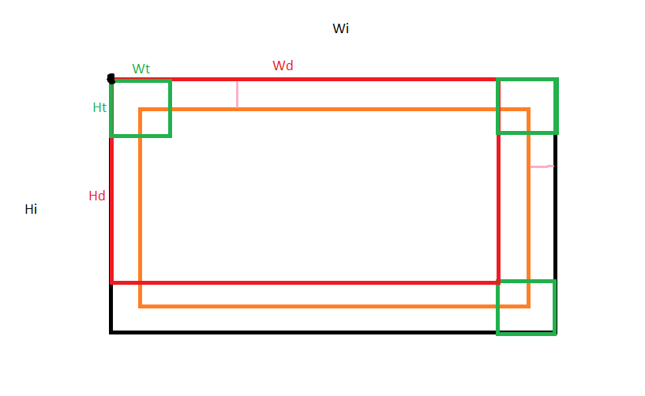

Laboratorio IV Sistemas Operativos 2 
### Ingeniería en Computación - FCEFyN - UNC
# Memoria compartida

## Introducción
Los niveles de integración electrónica han permitido la generación de procesadores de arquitecturas multiprocesos, multicore, híbridos y ahora many integrated core (MIC). Este avance hace necesario que los programadores cuenten con un profundo conocimiento del hardware sobre el que se ejecutan sus programas, y que dichos programas ya no pueden ser monoproceso.

## Imagen
En primer lugar se investigó acerca de los diferentes formatos de imagen existentes, para determinar cual de ellos sería el más simple para trabajar. Se optó por el formato PGM ya que es de los más simples, solo consta de 3 lineas de encabezado, el tipo pgm, las dimensiones y el valor máximo. Cabe destacar que en el presente laboratorio se trabaja con imagenes en escala de grises, por lo tanto se representa el nivel de gris con un numero entre 0 a 255 que se almacena como caracter (char).

Para cargar las imágenes en memoria se adaptó el código del ejemplo que se referencia en este informe, convirtiendo previamente las imagenes PNG a PGM con la web Converio.co. Una vez que se tienen las imagenes cargadas en memoria se procede a aplicar el algoritmo que sigue.

## Reconocimiento de Patrones
El algoritmo de reconocimiento de patrones consiste en tomar una porcion de la imagen del mismo tamaño que el patron, y comparar pixel a pixel con el patron a reconocer para encontrar la distancia euclideana, que se calcula de la siguiente manera:

En este caso, se identifica unívocamente a cada posible ventana de la imagen mediante el pixel superior izquierdo de la misma. Una vez calculada su distancia con el patrón, se almacena este valor en la matriz de distancias euclideanas. Nótese que la cantidad de posibles ventanas es menor a la cantidad de pixeles de la imagen, en concreto, la dimensión de la matriz de distancias es:
Ancho: Wd = Wi - Wt + 1
Alto: Hd = Hi - Ht + 1

## Paralelización
Una vez que el algoritmo estuvo implementado con éxito, se paraleliza la ejecución de la función compute_distances() ya que es la que más influye en el tiempo de ejecución de todo el programa. Para lograr la paralelización se emplea la **libería OpenMP**, haciendo uso de su **pragma omp parallel for**, que permite optimizar la ejecución de un for de muchas iteraciones, indicandole cuales son las variables indices. En este caso, se trata de 4 bucles for anidados, por lo que se le indica a omp las 4 variables i, j, u, v respectivamente.

Es importante mencionar que se compiló haciendo uso de la flag -O2, que optimiza considerablemente el código, ayudando a disminuir los tiempos de ejecución. A continuación se indican los tiempos de ejecución del programa en una **Raspberry Pi 4** (de 4 núcleos), pasando como parámetro el número de hilos o **threads** que debe emplear OpenMP al paralelizar.

| Threads | Tiempo MM:SS |
|---------|:-------:|
| 1 | 02:53 | 
| 2 | 01:26 | 
| 3 | 00:57 | 
| 4 | 00:43 | 
| 5 | 00:45 | 
| 6 | 00:46 | 
| 8 | 00:43 | 
| 12 | 00:43 |
| 16 | 00:43 |
| 32 | 00:43 |
| 64 | 00:43 |

Gracias a la anterior comparativa, se puede observar que gracias a la paralelización que ofrece la libería OpenMP se reducen los tiempos de ejecución de manera aproximadamente proporcional a la cantidad de threads empleados, hasta llegar al límite físico de 4 threads, a partir del cual se observan tiempos similares.

## Referencias
- [Introduction to parallel programming](https://hpc.llnl.gov/documentation/tutorials/introduction-parallel-computing-tutorial)
- [OpenMP Tutorial](https://hpc-tutorials.llnl.gov/openmp/)
- https://convertio.co/
- https://www.geeksforgeeks.org/how-to-read-a-pgmb-format-image-in-c/
- https://byjus.com/gate/size-of-data-types-in-c/

Autor: Federico Coronati